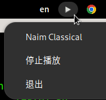

### v1.5 2025/06/20 
1. 捨棄 notify-send指令的 殭屍執行緒問題, 改採用 Notify來推送通知.
2. 在 system tray的圖示下拉可以顯示目前播放曲目.
3. 修正 mpv子執行緒的 mpvsocket與主程式的先後polling機制. 

---
### v1.0 2025/06/19 initial

---
### 功能說明
一個用 Python 撰寫的 GNOME 系統圖示工具，點擊圖示即可播放或停止指定的網路串流（使用 mpv 播放器），支援：
* GNOME system tray integration（使用 libayatana-appindicator3）

* 串流清單來自 ~/.config/mpvwidget-site.conf

* 點選清單即播放；再點「停止播放」即中止 mpv

* 使用 notify-send 顯示目前播放內容




### 檔案結構
```
mpv-widget/
├── mpv_widget.py                  ← 主程式
├── mpvwidget.desktop              ← 可選啟動器（放入 ~/.local/share/applications/）
└── config/mpvwidget-site.conf     ← 用戶自定的串流清單檔案（放在 ~/.config/）
```

### 安裝需求
```bash
sudo apt update
sudo apt install mpv python3-gi gir1.2-gtk-3.0 gir1.2-ayatanaappindicator3-0.1 libnotify-bin
```

### 使用者安裝步驟
```
git clone <this_repo_url>
cd mpv-widget
```

```bash
mkdir -p ~/.config
mkdir -p ~/bin
cp config/mpvwidget-site.conf ~/.config/
cp mpv_widget.py ~/bin/
#curl -o ~/.config/mpvwidget-site.conf https://example.com/mpvwidget-site.conf  # 或自己建立
#curl -o ~/bin/mpv_widget.py https://example.com/mpv_widget.py
chmod +x ~/bin/mpv_widget.py
```
### 設定串流清單
建立或編輯檔案：
```bash
nano ~/.config/mpvwidget-site.conf
```
```
#格式為每行一筆：
名稱1|https://網址1
名稱2|https://網址2
```

### 執行程式
```bash
~/bin/mpv_widget.py &
```
圖示會出現在 GNOME 系統右上角，點選即可播放串流。

### 建立桌面啟動器
repo.中已建立一個起動器捷徑檔, 複製到自己的桌面環境應用程式捷徑區.
```bash
cp mpvwidget.desktop ~/.local/share/applications/mpvwidget.desktop
```
```bash
並且編輯其中的路徑YOUR_USERNAME為你的使用者id,
====
[Desktop Entry]
Type=Application
Name=MPV 控制器
Exec=/home/YOUR_USERNAME/bin/mpv_widget.py
Icon=media-playback-start
Terminal=false
Categories=Audio;Player;
====
```

### 後續延伸設定：
mpv 可以加入參數 --audio-buffer=\<num\> (default=0.2) 
我這邊設定 \<num\> =10
並且在 on_stream_selected函數中
```
... subprocess.Popen(["mpv","--no-video","--audio-buffer=10",url])
```
加入參數清單, 可讓 mpv執行時比較不會因為網路狀況造成斷斷續續.

